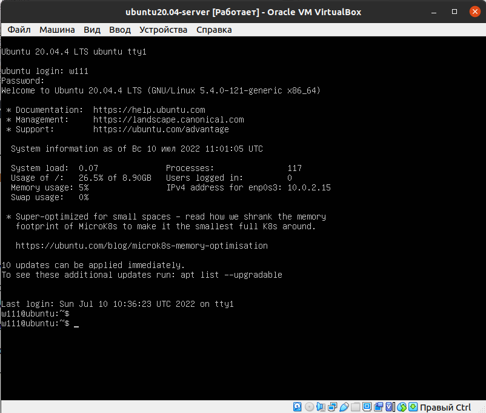
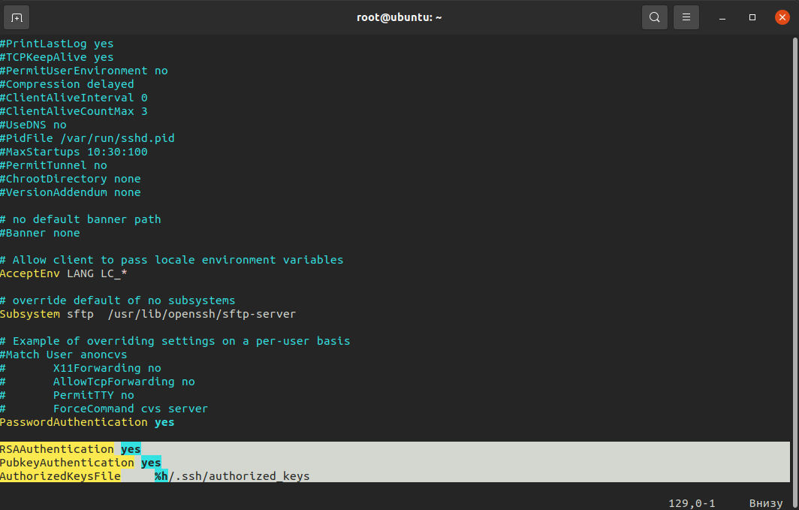
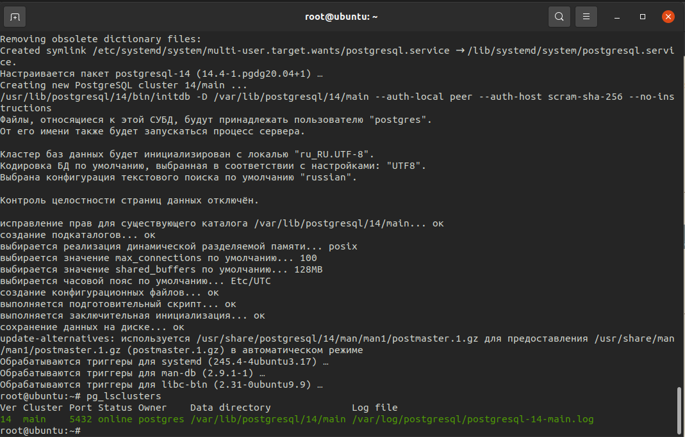
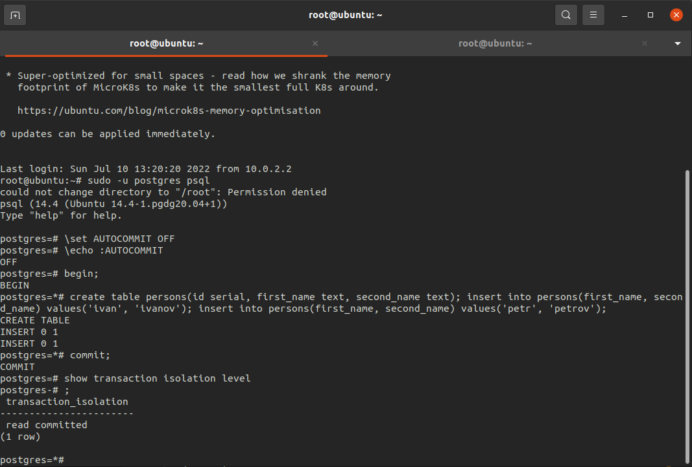
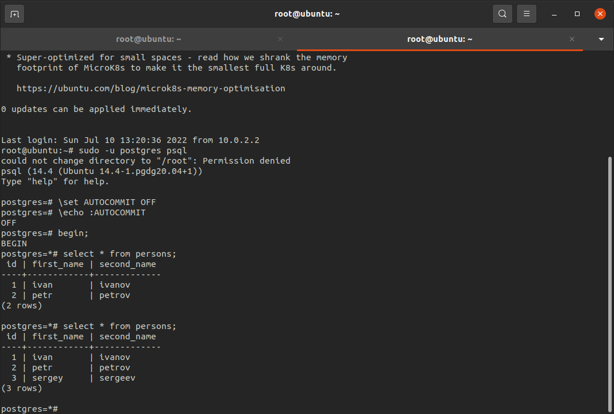
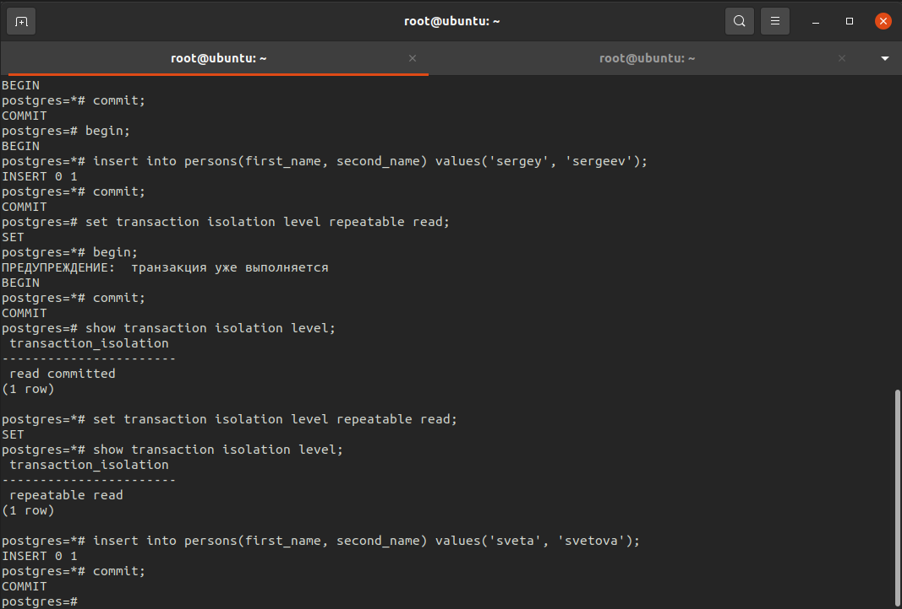
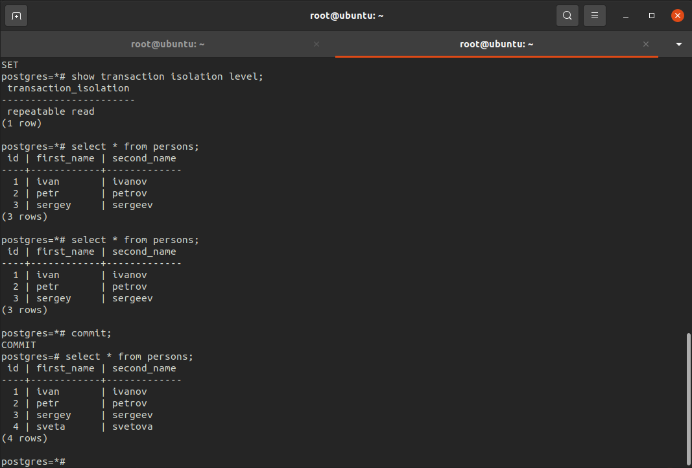

# Домашняя работа №1

1. * создать новый проект в Google Cloud Platform, Яндекс облако или на любых ВМ, докере, например postgres2022-, где yyyymmdd год, месяц и день вашего рождения (имя проекта должно быть уникально на уровне GCP)
   * далее создать инстанс виртуальной машины Compute Engine с дефолтными параметрами

_Создал виртуальную машину Ubuntu 20.04 Server с 4гб оперативной памяти, 10 гб места на диске._

2. * добавить свой ssh ключ в GCE metadata
   * зайти удаленным ssh (первая сессия), не забывайте про ssh-add

_Подключился к ВМ с локальной машины, добавил свой ключ в authorized_keys, настроил доступ к ВМ по ключу_

3. поставить PostgreSQL

_Установил PostgreSQL 14_

4. зайти вторым ssh (вторая сессия)

    _Открыл еще одну сессию_

5. * запустить везде psql из под пользователя postgres
   * выключить auto commit
   * сделать в первой сессии новую таблицу и наполнить ее данными create table persons(id serial, first_name text, second_name text); insert into persons(first_name, second_name) values('ivan', 'ivanov'); insert into persons(first_name, second_name) values('petr', 'petrov'); commit;
   * посмотреть текущий уровень изоляции: show transaction isolation level

6. * начать новую транзакцию в обоих сессиях с дефолтным (не меняя) уровнем изоляции
   * в первой сессии добавить новую запись insert into persons(first_name, second_name) values('sergey', 'sergeev');
   * сделать select * from persons во второй сессии
   * видите ли вы новую запись и если да то почему?

   _Новой записи не видно, потому что по-умолчанию стоит уровень транзакций "read committed", который не позволяет читать незакоммиченные данные_

7. * завершить первую транзакцию - commit;
   * сделать select * from persons во второй сессии
   * видите ли вы новую запись и если да то почему?

_Теперь новая запись появилась, так как транзакция, вставляющая ее, была завершена и "грязного чтения" не произошло, но произошло "фантомное чтение" до закрытия второй транзакции_

8. завершите транзакцию во второй сессии
9. * начать новые но уже repeatable read транзации - set transaction isolation level repeatable read;
   * в первой сессии добавить новую запись insert into persons(first_name, second_name) values('sveta', 'svetova');
   * сделать select * from persons во второй сессии
   * видите ли вы новую запись и если да то почему?

   _Новую запись не видно, потому что "грязное чтение" также не работает и на "repeatable read" уровне_

10. * завершить первую транзакцию - commit;
    * сделать select * from persons во второй сессии
    * видите ли вы новую запись и если да то почему?

    _Новую запись по-прежнему не видно, так как "фантомного чтения" нет в постгрес на уровне "repeatable read"_

11. * завершить вторую транзакцию
    * сделать select * from persons во второй сессии
    * видите ли вы новую запись и если да то почему?

    _Теперь новая запись появилась, так как все аномалии были решены_

