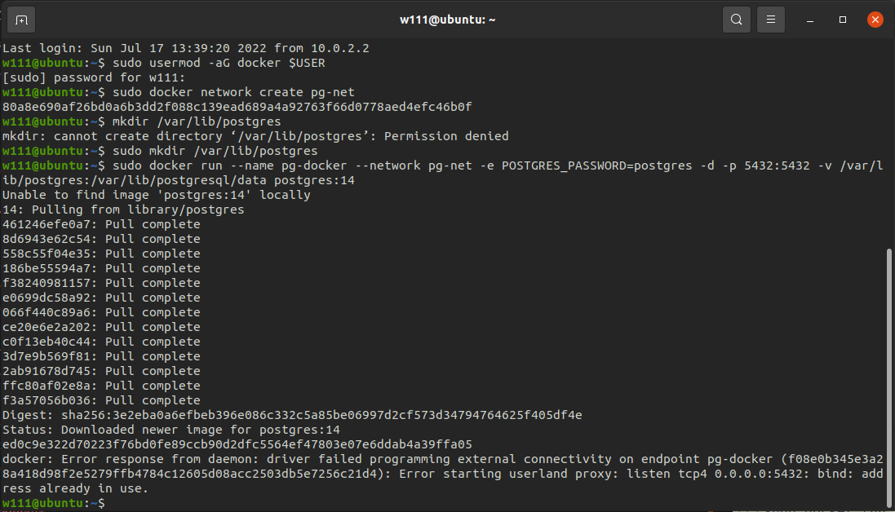
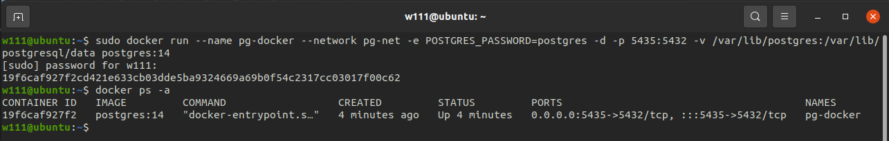
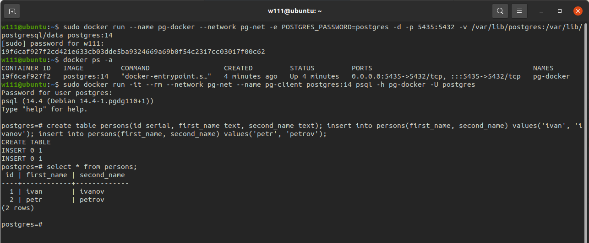
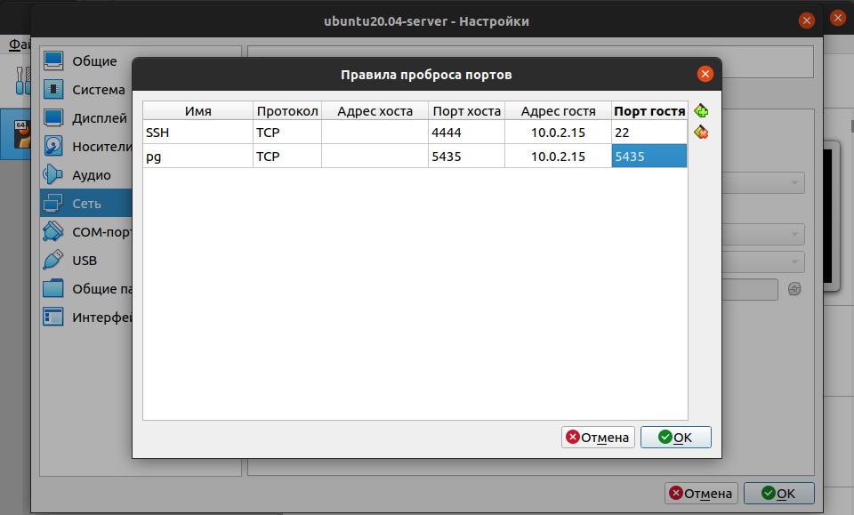
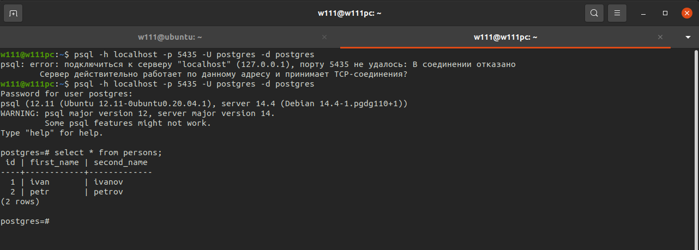
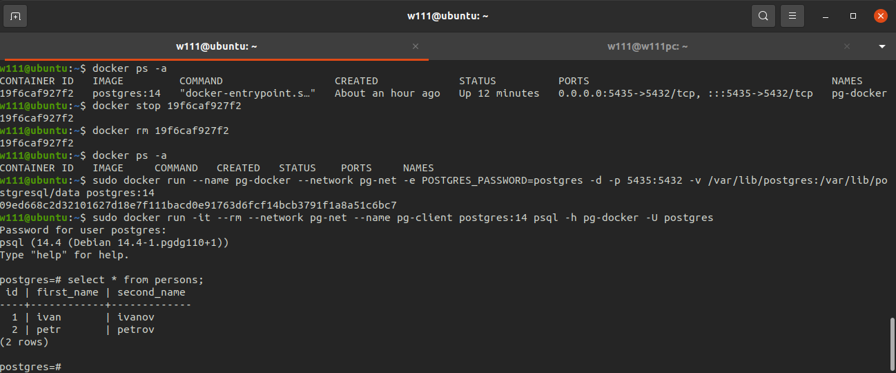

# Домашняя работа №2
1. * сделать в GCE инстанс с Ubuntu 20.04 или развернуть докер любым удобным способом
   * поставить на нем Docker Engine

    _Установил докер с помощью get-docker.sh на ВМ, созданную в прошлом ДЗ_

2. * сделать каталог /var/lib/postgres
   * развернуть контейнер с PostgreSQL 14 смонтировав в него /var/lib/postgres
   
   

   * _Создал докер-сеть для объединения будущих контейнеров с клиентом и сервером_
   * _Создал директорию /var/lib/postgres для тома постгреса_
   * _Столкнулся с ошибкой при развертывании контейнера, так как порт был уже занят бд, изменил порт - контейнер развернулся_

* развернуть контейнер с клиентом postgres
* подключится из контейнера с клиентом к контейнеру с сервером и сделать таблицу с парой строк
   

    _Развернул контейнер с клиентом постгрес, создал таблицу с двумя записями_

5. подключится к контейнеру с сервером с ноутбука/компьютера извне инстансов GCP/места установки докера
   
   

    _Вначале не удалось подключиться с локальной машины, так как 5435 порт не был прокинут. Прокинул его в настройках ВМ - все заработало_

6. * удалить контейнер с сервером
   * создать его заново
   * подключится снова из контейнера с клиентом к контейнеру с сервером
   * проверить, что данные остались на месте
   

    _Удалил контейнер, снова создал его в той же сети, с тем же именем и томом бд, подключился к нему из контейнера с клиентом - данные на месте_
